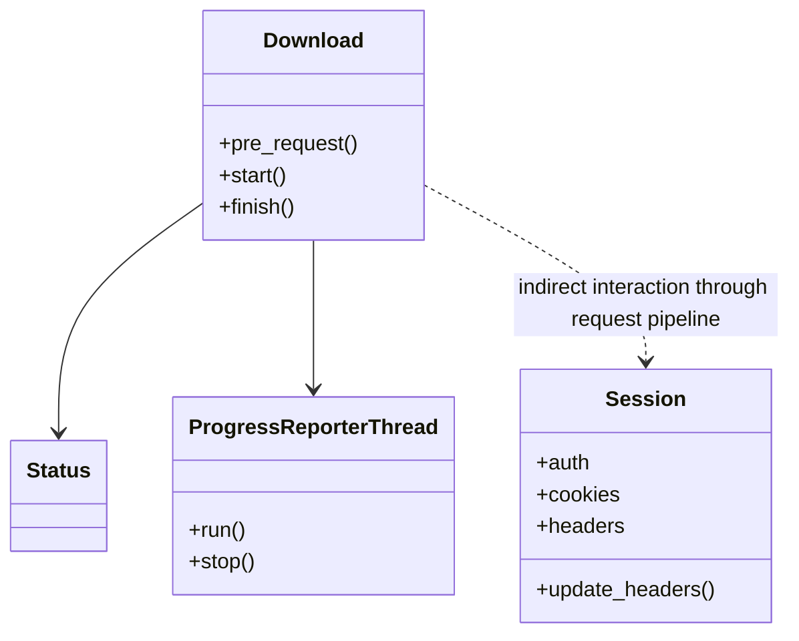
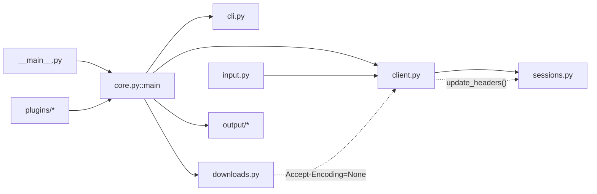

# Graphify Agent — EX04: Reverse Engineering, Debugging and Token-Efficient Agentic AI

## Chosen Repository & Bug Justification

We chose **[HTTPie](https://github.com/jakubroztocil/httpie)** via its **BugsInPy** entry (`projects/httpie`) as our base repository. HTTPie is a real-world, multi-module command-line HTTP client (CLI argument parsing, HTTP client/session handling, downloads, output formatting, and plugins) — large and structured enough to produce a meaningful Grphify graph, architectural block diagram, and OOP schema, while still being approachable for two people. Within this codebase, we picked **Bug #3**: in `httpie/sessions.py`, `Session.remove_cookies`/header-update logic calls `value.decode('utf8')` on header values without checking for `None`, causing an `AttributeError` whenever a session has explicitly unset headers (covered by `tests/test_sessions.py::TestSession::test_download_in_session`). This bug is small and localized — a one-line guard fix — yet it sits inside the session/config layer, which connects to several other modules (CLI, client, downloads), making it a good focal point for `hot.md` and the graph-guided agent. BugsInPy provides a reproducible buggy/fixed commit pair and a ready-to-run failing test, which we use for the agent investigation, the fix verification, and the token-efficiency comparison (Tasks C–E).

## Problem / Bug Description

*(To be completed after investigation — see `obsidian/hot.md`.)*

## Research Questions

### Which components are the most central?

Graph analysis identified the following highly connected components:

* `httpie/core.py::main`
* `httpie/input.py`
* `httpie/output/streams.py`
* `httpie/downloads.py`
* `httpie/plugins/manager.py::PluginManager`

The strongest orchestration hub is `httpie/core.py::main`, which has 21 outgoing connections and coordinates multiple independent subsystems.

### What architectural insight was discovered?

The investigation revealed a hidden dependency between the download subsystem and the session persistence subsystem.

At first glance, `downloads.py` and `sessions.py` appear unrelated. However, analysis revealed the following execution path:

`downloads.py` → `client.py::get_response()` → `Session.update_headers()` → `AttributeError`

The download subsystem disables compression by setting:

`Accept-Encoding = None`

This value is passed through the request pipeline until it reaches `Session.update_headers()`, which assumes that all header values are valid byte strings and attempts to execute:

`value.decode("utf8")`

without checking whether the value is `None`.

This cross-module dependency is not obvious from isolated file inspection and was only discovered through architectural analysis and graph navigation.

## Architecture Overview

HTTPie is organized into several major subsystems that work together to process HTTP requests and responses.

The system starts from `__main__.py`, which invokes `core.py::main`. This function acts as the primary orchestration component and coordinates the execution flow across the application.

The main architectural subsystems identified during reverse engineering are:

* Input Processing (`input.py`)
* CLI Layer (`cli.py`)
* Core Orchestration (`core.py`)
* Request Execution (`client.py`)
* Session Persistence (`sessions.py`)
* Download Management (`downloads.py`)
* Output Formatting and Streaming (`output/*`)
* Plugin Infrastructure (`plugins/*`)

Graph analysis revealed that the architecture follows a layered structure where user input is parsed, transformed into request objects, processed by the client layer, persisted in sessions, and finally rendered through the output subsystem.

## OOP Schema

## Architecture Diagram

## Agent Workflow

*(To be completed — CrewAI/LangGraph workflow description.)*

## Grphify & Obsidian Usage

*(To be completed.)*

## Reverse Engineering Process

### Macro Analysis

We began by analyzing the graph generated by Grphify. The graph contains 225 nodes and 445 edges, including modules, classes, and functions.

The hub analysis revealed that `core.py::main` is the primary orchestration node of the application.

### Community Investigation

The investigation then focused on the subsystem surrounding:

* `sessions.py`
* `downloads.py`
* `client.py`

These modules participate in the execution path that triggers Bug #3.

### Hidden Dependency

The most important discovery was a hidden dependency between `downloads.py` and `sessions.py`.

`downloads.py` sets:

`Accept-Encoding = None`

This value propagates through:

`downloads.py`
→ `client.py::get_response()`
→ `Session.update_headers()`

The crash occurs when `Session.update_headers()` executes:

`value.decode("utf8")`

without checking whether the value is `None`.

### Complexity Hotspots

The primary hotspots identified during reverse engineering are:

* `sessions.py`
* `client.py`
* `core.py::main`

`sessions.py` contains the root cause of Bug #3 and manages session persistence, authentication, cookies, and header handling.

### God Node Analysis

The strongest God Node candidate is:

`httpie/core.py::main`

Evidence:

* Highest outgoing connectivity in the graph (21 outgoing edges).
* Coordinates several independent subsystems.
* Acts as the central execution hub of the application.
* Imports and orchestrates CLI, Client, Downloads, Output, and Context functionality.

Although its responsibilities are primarily orchestration-related, its high degree of connectivity makes it the most influential node in the architecture.

## Bug Description, Root Cause & Fix

*(To be completed.)*

## Before / After Comparison

*(To be completed.)*

## Token Efficiency Comparison

*(To be completed — see `reports/token_comparison.md`.)*

## Original Extensions

*(To be completed.)*

## Run Instructions

*(To be completed.)*
