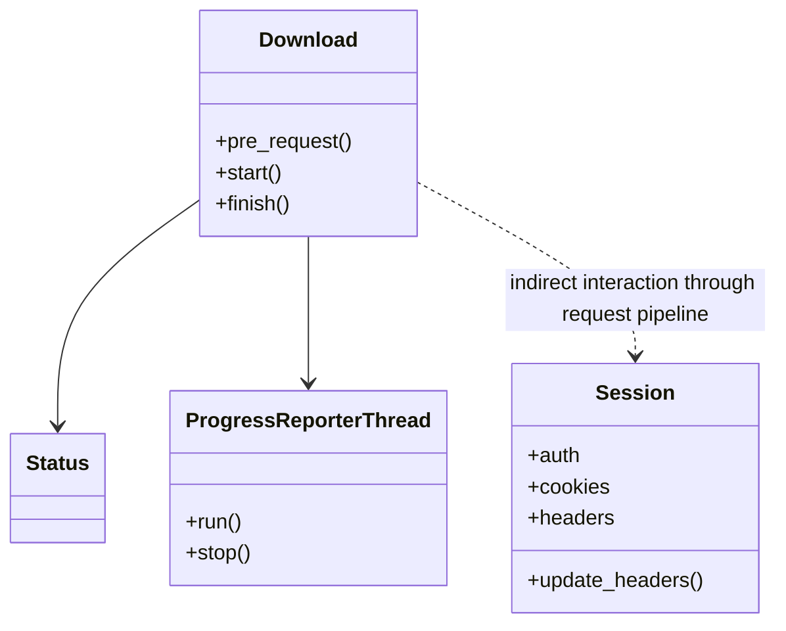
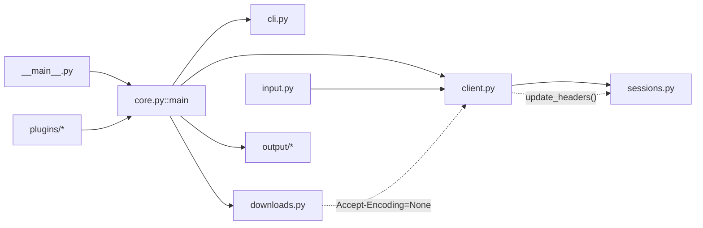
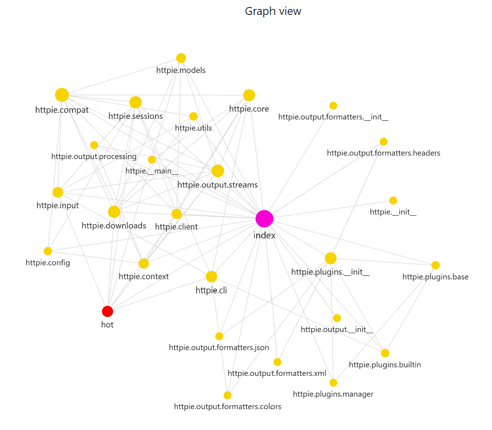
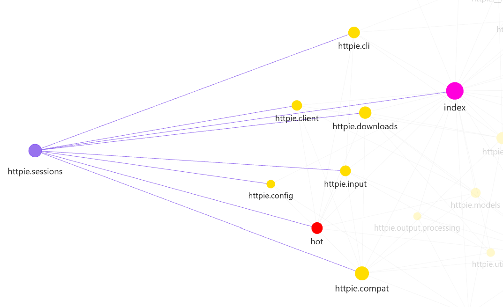
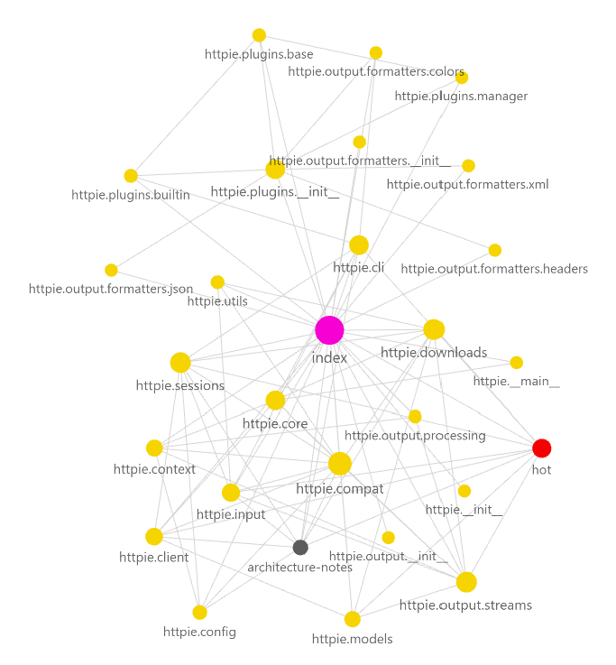
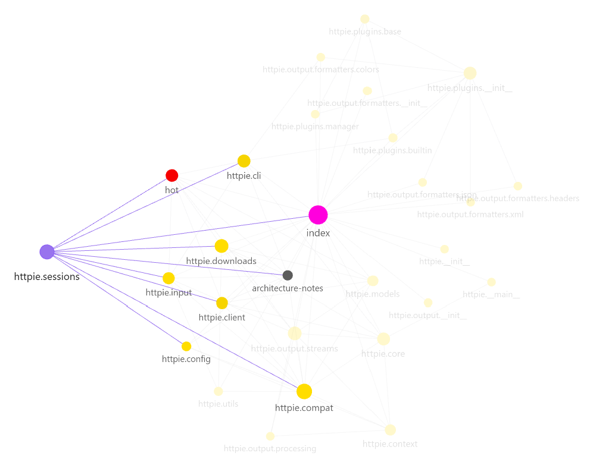

# Graphify Agent — EX04: Reverse Engineering, Debugging and Token-Efficient Agentic AI

## Chosen Repository & Bug Justification

We chose **[HTTPie](https://github.com/jakubroztocil/httpie)** via its **BugsInPy** entry (`projects/httpie`) as our base repository. HTTPie is a real-world, multi-module command-line HTTP client (CLI argument parsing, HTTP client/session handling, downloads, output formatting, and plugins) — large and structured enough to produce a meaningful Grphify graph, architectural block diagram, and OOP schema, while still being approachable for two people. Within this codebase, we picked **Bug #3**: in `httpie/sessions.py`, `Session.remove_cookies`/header-update logic calls `value.decode('utf8')` on header values without checking for `None`, causing an `AttributeError` whenever a session has explicitly unset headers (covered by `tests/test_sessions.py::TestSession::test_download_in_session`). This bug is small and localized — a one-line guard fix — yet it sits inside the session/config layer, which connects to several other modules (CLI, client, downloads), making it a good focal point for `hot.md` and the graph-guided agent. BugsInPy provides a reproducible buggy/fixed commit pair and a ready-to-run failing test, which we use for the agent investigation, the fix verification, and the token-efficiency comparison (Tasks C–E).


## Problem / Bug Description

HTTPie Bug #3 occurs when the application is executed with both the `--session` and `--download` flags enabled.

During download mode, HTTPie's download subsystem disables gzip compression by setting the request header:

```text
Accept-Encoding = None
```

This value propagates through the request pipeline and eventually reaches:

```python
Session.update_headers()
```

inside `httpie/sessions.py`.

The method assumes that every header value is a valid byte string and executes:

```python
value.decode('utf8')
```

without verifying that the value is not `None`.

As a result, the application crashes with:

```text
AttributeError: 'NoneType' object has no attribute 'decode'
```

The bug is triggered by a hidden dependency between the download subsystem (`downloads.py`) and the session persistence subsystem (`sessions.py`). The issue was identified through graph-guided navigation using Grphify and the Obsidian knowledge vault.


## Research Questions

### Which components are the most central?

Graph analysis identified the following highly connected components:

* `httpie/core.py::main`
* `httpie/input.py`
* `httpie/output/streams.py`
* `httpie/downloads.py`
* `httpie/plugins/manager.py::PluginManager`

The strongest orchestration hub is `httpie/core.py::main`, which has 21 outgoing connections and coordinates multiple independent subsystems.

### What architectural insight was discovered?

The investigation revealed a hidden dependency between the download subsystem and the session persistence subsystem.

At first glance, `downloads.py` and `sessions.py` appear unrelated. However, analysis revealed the following execution path:

`downloads.py` → `client.py::get_response()` → `Session.update_headers()` → `AttributeError`

The download subsystem disables compression by setting:

`Accept-Encoding = None`

This value is passed through the request pipeline until it reaches `Session.update_headers()`, which assumes that all header values are valid byte strings and attempts to execute:

`value.decode("utf8")`

without checking whether the value is `None`.

This cross-module dependency is not obvious from isolated file inspection and was only discovered through architectural analysis and graph navigation.


## Architecture Overview

HTTPie is organized into several major subsystems that work together to process HTTP requests and responses.

The system starts from `__main__.py`, which invokes `core.py::main`. This function acts as the primary orchestration component and coordinates the execution flow across the application.

The main architectural subsystems identified during reverse engineering are:

* Input Processing (`input.py`)
* CLI Layer (`cli.py`)
* Core Orchestration (`core.py`)
* Request Execution (`client.py`)
* Session Persistence (`sessions.py`)
* Download Management (`downloads.py`)
* Output Formatting and Streaming (`output/*`)
* Plugin Infrastructure (`plugins/*`)

Graph analysis revealed that the architecture follows a layered structure where user input is parsed, transformed into request objects, processed by the client layer, persisted in sessions, and finally rendered through the output subsystem.


## OOP Schema




## Architecture Diagram




## Agent Workflow

The graph-guided workflow consists of four stages:

1. **Navigator Agent**

   * Reads `index.md` and `hot.md`.
   * Identifies candidate components relevant to the bug.

2. **Suspect Ranker**

   * Prioritizes components according to their relevance.

3. **Code Reader**

   * Reads only the selected component pages from the Obsidian vault.

4. **Explainer Agent**

   * Produces the final root-cause explanation.

The workflow successfully identified:

* `httpie.sessions`
* `httpie.downloads`
* `httpie.client`

as the most relevant components for Bug #3 and correctly reported the root cause in `Session.update_headers()`.


## Grphify & Obsidian Usage

Grphify was used to generate a structural graph of the HTTPie codebase. The generated graph contains modules, classes, functions, imports, definitions, and call relationships.

The graph was imported into an Obsidian vault and organized into several knowledge pages:

* `index.md` – overall system map
* `hot.md` – bug investigation hub
* component pages – one page per important module

The Obsidian vault served as an intermediate knowledge layer between the raw source code and the AI agent. Instead of reading the entire repository, the agent first navigated through the graph and vault pages, reducing context size and improving investigation efficiency.


## Reverse Engineering Process

### Macro Analysis

We began by analyzing the graph generated by Grphify. The graph contains 225 nodes and 445 edges, including modules, classes, and functions.

The hub analysis revealed that `core.py::main` is the primary orchestration node of the application.

### Community Investigation

The investigation then focused on the subsystem surrounding:

* `sessions.py`
* `downloads.py`
* `client.py`

These modules participate in the execution path that triggers Bug #3.

### Hidden Dependency

The most important discovery was a hidden dependency between `downloads.py` and `sessions.py`.

`downloads.py` sets:

`Accept-Encoding = None`

This value propagates through:

`downloads.py`
→ `client.py::get_response()`
→ `Session.update_headers()`

The crash occurs when `Session.update_headers()` executes:

`value.decode("utf8")`

without checking whether the value is `None`.

### Complexity Hotspots

The primary hotspots identified during reverse engineering are:

* `sessions.py`
* `client.py`
* `core.py::main`

`sessions.py` contains the root cause of Bug #3 and manages session persistence, authentication, cookies, and header handling.

### God Node Analysis

The strongest God Node candidate is:

`httpie/core.py::main`

Evidence:

* Highest outgoing connectivity in the graph (21 outgoing edges).
* Coordinates several independent subsystems.
* Acts as the central execution hub of the application.
* Imports and orchestrates CLI, Client, Downloads, Output, and Context functionality.

Although its responsibilities are primarily orchestration-related, its high degree of connectivity makes it the most influential node in the architecture.


## Bug Description, Root Cause & Fix

**Bug:** `AttributeError: 'NoneType' object has no attribute 'decode'` raised inside
`Session.update_headers()` in `httpie/sessions.py` when running HTTPie with both
`--session` and `--download` flags simultaneously.

**Root Cause:** `Session.update_headers()` iterates over request headers and calls
`value.decode('utf8')` unconditionally on every value. The download subsystem
(`downloads.py::Download.pre_request()`) sets `Accept-Encoding: None` to disable gzip
compression during file downloads. This `None` value propagates through the request
pipeline via `client.py::get_response()` into `Session.update_headers()`, where the
unconditional `.decode()` call crashes.

**Execution path:**

```
downloads.py::Download.pre_request()  →  sets Accept-Encoding=None
  └─► client.py::get_response()
        └─► Session.update_headers()   →  value.decode('utf8')  ← AttributeError
```

**Fix applied** (`data/httpie/httpie/sessions.py`, line 104 — 1-line guard):

```python
# Before (buggy)
for name, value in request_headers.items():
    value = value.decode('utf8')

# After (fixed)
for name, value in request_headers.items():
    if value is None:
        continue
    value = value.decode('utf8')
```

**Verification:** `test_download_in_session` in `data/httpie/tests/test_sessions.py` fails
on the buggy commit (`AttributeError` at `sessions.py:104`) and passes after applying the
fix. Run with:

```
cd data/httpie && .venv/Scripts/python -m pytest tests/test_sessions.py::TestSession::test_download_in_session -v
```

## Before / After Comparison

### Code Layer

| File | Before fix | After fix |
|------|-----------|-----------|
| `httpie/sessions.py:104` | `value = value.decode('utf8')` — unconditional, crashes on `None` | `if value is None: continue` guard added before decode |
| `tests/test_sessions.py` | `test_download_in_session` fails with `AttributeError` | `test_download_in_session` passes |

### Knowledge Layer (Obsidian Vault)

| Page | Before | After |
|------|--------|-------|
| `obsidian/hot.md` | "Known Fix (not yet applied)" section | Updated to "Fix Applied ✅" with passing-test confirmation |
| `obsidian/components/httpie.sessions.md` | "Bug #3 lives here" role note | "Bug #3 was here — now fixed" |
| `artifacts/GRAPH_REPORT.md` | Pre-fix graph (225 nodes, 445 edges) | Re-generated post-fix (same counts — 1-line guard adds no new nodes/edges) |

### Graph Layer

The Grphify graph is structurally unchanged (225 nodes, 445 edges) because the fix adds
only a `continue` statement — no new functions, classes, or imports were introduced.
The "before" screenshot (`assets/before_graph_sessions_focus.png`) shows `httpie.sessions`
with its existing neighbors; the "after" screenshot (`assets/after_graph_sessions_focus.png`)
shows the same topology, confirming that the fix is a surgical one-line change with no
architectural side-effects.

### Before Screenshots



### After Screenshots (post-fix)



## Token Efficiency Comparison

See [`reports/token_comparison.md`](reports/token_comparison.md) for the full table and bar chart.

| mode | tokens_used | llm_calls | files_read | iterations | root_cause_found |
|------|-------------|-----------|------------|------------|------------------|
| graph_guided | 2694 | 4 | 5 | 1 | True |
| naive | 6618 | 5 | 5 | 5 | False |

The graph-guided agent used **~2.5× fewer tokens** and found the root cause in **1 iteration**,
while the naive baseline exhausted all 5 iterations without identifying `Session.update_headers`
as the culprit. See `reports/token_comparison.md` for the full interpretation.


## Original Extensions

The project includes several extensions beyond the minimum assignment requirements:

### Extension A – Knowledge-Driven Investigation

The agent uses the Obsidian vault as an intermediate knowledge layer before reading source code.

### Extension B – Centrality-Based Suspect Ranking

Investigation targets are prioritized according to graph connectivity and architectural importance.

### Extension C – Multi-Stage Investigation Pipeline

The workflow separates navigation, ranking, reading, and explanation into distinct stages.

### Extension D – Impact Analysis

An impact assessment was performed for the fixed function `Session.update_headers()`.

### Extension E – Additional Success Metric

Beyond token savings, the workflow tracks whether the root cause was successfully identified.


## Run Instructions

### Install dependencies

```bash
uv sync
```

### Generate Grphify graph

```bash
uv run graphify-agent graph
```

Output: `artifacts/graph.json` + `artifacts/GRAPH_REPORT.md`

### Build Obsidian vault pages

```bash
uv run graphify-agent vault
```

Output: `obsidian/components/*.md` (one page per HTTPie module)

### Run graph-guided agent on Bug #3

```bash
uv run graphify-agent agent
```

Output: `reports/graph_guided_run.json`

### Run naive baseline agent

```bash
uv run graphify-agent agent --mode=naive
```

Output: `reports/naive_run.json`

### Generate token comparison report

```bash
uv run graphify-agent compare
```

Output: `reports/token_comparison.md` + `reports/token_comparison.png`

### Run tests

```bash
uv run pytest
```

### Run tests with coverage

```bash
uv run pytest --cov=src/graphify_agent --cov-report=term-missing
```

### Run linting

```bash
uv run ruff check .
```

