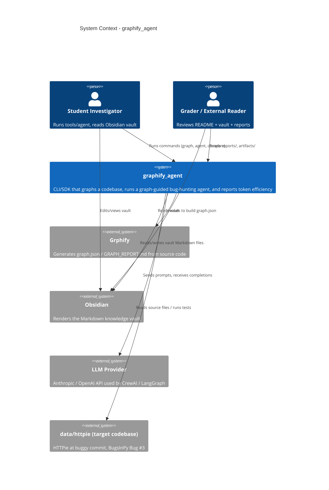
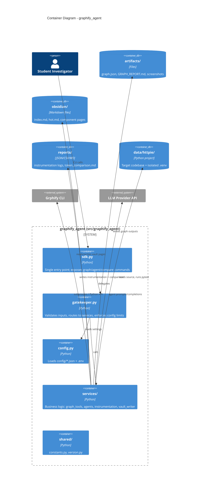
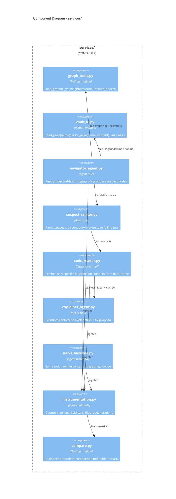
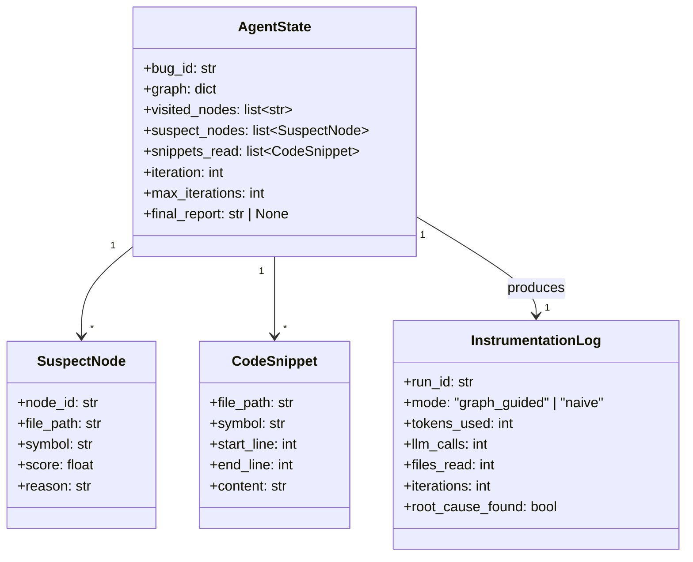
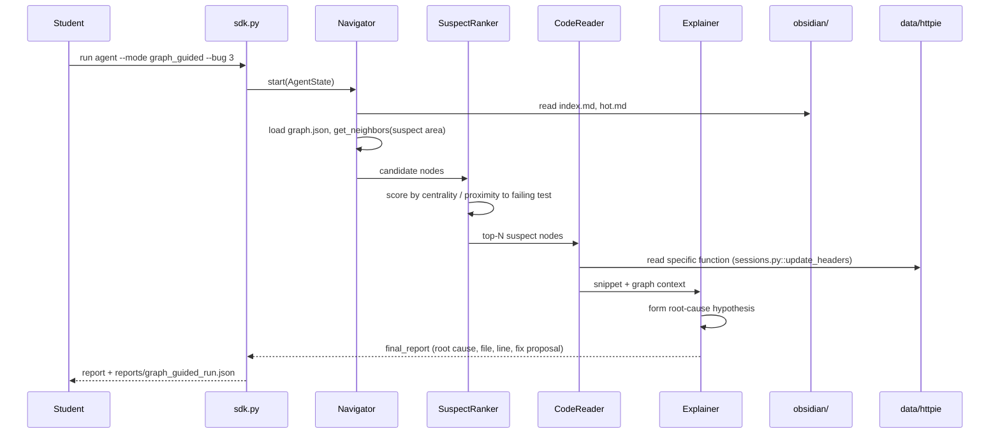
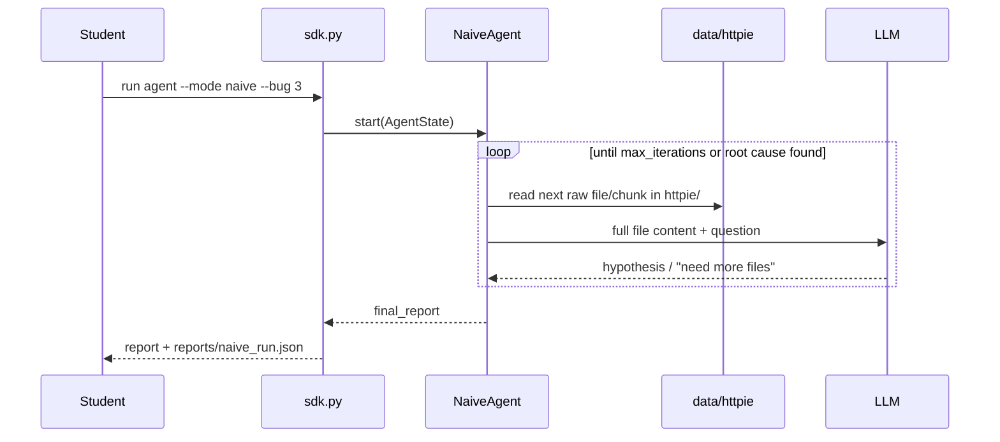
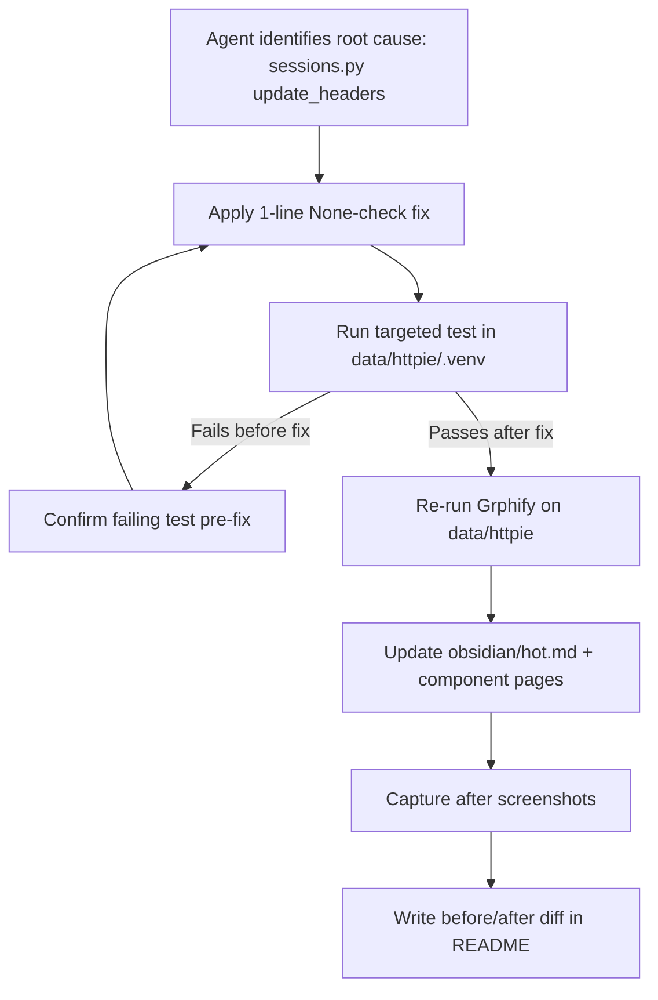
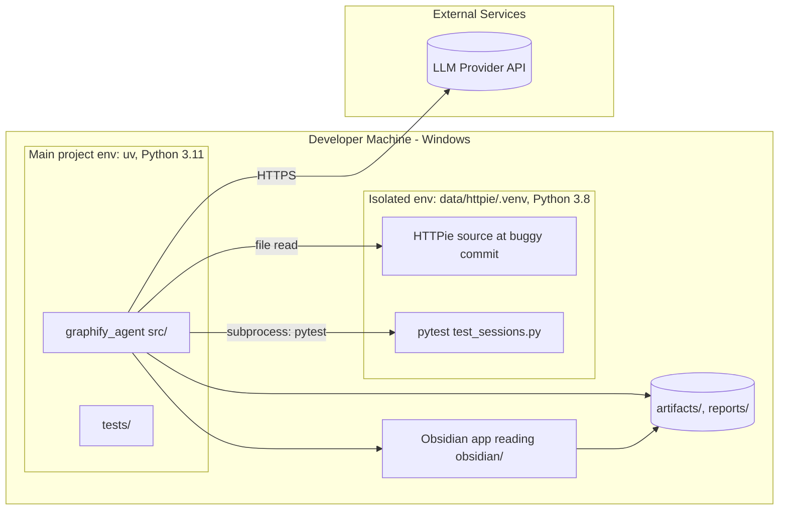

# Architecture & Planning Document (PLAN)

This document describes the technical architecture of `graphify_agent` — the
toolkit and agent built for EX04 — and how it relates to the target codebase
(`data/httpie`, HTTPie Bug #3). See `docs/PRD.md` for requirements and
`docs/TODO.md` for task tracking.

---

## 1. C4 Model

### 1.1 Context (Level 1)



### 1.2 Container (Level 2)



### 1.3 Component (Level 3) - `services/`



### 1.4 Code (Level 4) - Graph-Guided Agent State



---

## 2. UML - Process Diagrams

### 2.1 Sequence - Graph-Guided Investigation



### 2.2 Sequence - Naive Baseline



### 2.3 Activity - Fix & Verification Flow



---

## 3. Deployment Diagram



**Note:** No server/cloud deployment is required for this assignment; both
environments run locally. The diagram documents the *process boundary*
between the main `uv` project and the isolated `data/httpie/.venv`, which is
the most important "deployment" decision (see ADR-001).

---

## 4. Architecture Decision Records (ADRs)

### ADR-001: Use BugsInPy's HTTPie entry, isolated `.venv` under `data/httpie`

- **Status:** Accepted
- **Context:** Bug #3 requires Python 3.7/3.8 and pinned dependencies, while
  the main project uses `uv` with Python >=3.11.
- **Decision:** Keep `data/httpie/` as a separate git checkout with its own
  `.venv` (Python 3.8) and `requirements-bug3.txt`. The main `uv` project
  never imports HTTPie code directly - it only reads files as text and shells
  out to `data/httpie/.venv/Scripts/python -m pytest`.
- **Alternatives considered:** Docker (per BugsInPy default) - rejected for
  this assignment due to setup overhead vs. benefit for a single bug;
  documented as a possible extension.
- **Trade-offs:** Slightly more setup complexity, but avoids dependency
  conflicts and keeps `pyproject.toml` clean.

### ADR-002: LangGraph over CrewAI

- **Status:** Accepted
- **Context:** Course guidance recommends LangGraph for limited free-tier LLM
  accounts because it gives explicit control over steps/iterations and is
  easier to instrument.
- **Decision:** Implement the agent workflow (Navigator -> SuspectRanker ->
  CodeReader -> Explainer, plus the naive baseline) as a LangGraph state
  graph using the `AgentState` schema (Section 1.4).
- **Alternatives considered:** CrewAI - more opinionated multi-agent
  orchestration, but harder to bound LLM calls precisely.
- **Trade-offs:** LangGraph requires more manual wiring of nodes/edges, but
  gives precise control over the stop condition (FR7) and instrumentation
  hooks (FR6).

### ADR-003: Graph-first rule enforced via tool ordering, not prompting alone

- **Status:** Accepted
- **Context:** The assignment requires the agent to be graph-guided: consult
  `graph.json`/Obsidian before requesting code.
- **Decision:** The `code_reader` tool is only registered/available to the
  agent graph *after* the Navigator and SuspectRanker nodes have executed at
  least once and produced `suspect_nodes`. This is enforced structurally in
  the LangGraph edges, not just via system prompt instructions.
- **Alternatives considered:** Prompt-only instruction ("please check the
  graph first") - rejected as unreliable and harder to prove for Task E.
- **Trade-offs:** Slightly more rigid workflow, but makes the
  context-reduction mechanism verifiable and easy to explain in the README.

### ADR-004: Instrumentation as a cross-cutting logger, not per-agent code

- **Status:** Accepted
- **Context:** Both the graph-guided and naive agents must report identical
  metrics (tokens, LLM calls, files read, iterations) for a fair comparison.
- **Decision:** A single `instrumentation.py` module exposes
  `log_llm_call()`, `log_file_read()`, `log_iteration()`, called from both
  workflows; results are serialized to `reports/<run_id>.json` using the
  `InstrumentationLog` schema.
- **Alternatives considered:** Ad-hoc counters inside each agent - rejected,
  risk of inconsistent measurement between modes.
- **Trade-offs:** Requires both workflows to call the same logger
  consistently; enforced via a shared base class/wrapper.

### ADR-005: `graph.json` and Obsidian vault as the single source of truth for navigation

- **Status:** Accepted
- **Context:** Tasks A-C require the agent and human investigator to share
  the same map of the codebase.
- **Decision:** `graph_tools.py` reads `artifacts/graph.json` directly (no
  separate in-memory rebuild), and `vault_io.py` reads/writes the same
  `obsidian/*.md` files a human edits in Obsidian. No duplicate graph
  representation is maintained.
- **Trade-offs:** Couples the agent to Grphify's `graph.json` schema; if
  Grphify's output format changes, `graph_tools.py` needs updating
  (isolated to one module).

---

## 5. API / Interface Documentation

### 5.1 `graph_tools` module

| Function | Signature | Description |
|---|---|---|
| `load_graph` | `load_graph(path: Path) -> Graph` | Loads `artifacts/graph.json` into a `Graph` object (nodes + edges) |
| `get_node` | `get_node(graph: Graph, node_id: str) -> Node \| None` | Looks up a node by id |
| `get_neighbors` | `get_neighbors(graph: Graph, node_id: str, depth: int = 1) -> list[Node]` | Returns neighboring nodes up to `depth` hops |
| `search_nodes` | `search_nodes(graph: Graph, query: str) -> list[Node]` | Substring/keyword search over node names/paths |

### 5.2 `vault_io` module

| Function | Signature | Description |
|---|---|---|
| `read_page` | `read_page(name: str) -> str` | Reads `obsidian/<name>.md` |
| `write_page` | `write_page(name: str, content: str) -> None` | Writes/overwrites `obsidian/<name>.md` |
| `list_pages` | `list_pages() -> list[str]` | Lists all vault pages |

### 5.3 `instrumentation` module

| Function | Signature | Description |
|---|---|---|
| `log_llm_call` | `log_llm_call(run_id: str, tokens_in: int, tokens_out: int) -> None` | Records one LLM call |
| `log_file_read` | `log_file_read(run_id: str, file_path: str) -> None` | Records one file/snippet read |
| `log_iteration` | `log_iteration(run_id: str) -> None` | Increments iteration counter |
| `finalize` | `finalize(run_id: str, mode: str, root_cause_found: bool) -> InstrumentationLog` | Writes `reports/<run_id>.json` |

### 5.4 SDK entry points (`sdk.py`)

| Command | Description |
|---|---|
| `graphify_agent graph` | Run Grphify on `data/httpie`, write `artifacts/graph.json` + `GRAPH_REPORT.md` |
| `graphify_agent agent --mode {graph_guided,naive} --bug 3` | Run the investigation workflow, write `reports/<mode>_run.json` |
| `graphify_agent compare` | Read both run reports, write `reports/token_comparison.md` (table + chart) |

---

## 6. Data Schemas & Contracts

### 6.1 `artifacts/graph.json` (consumed, produced by Grphify)

```json
{
  "nodes": [
    {
      "id": "httpie/sessions.py::Session.update_headers",
      "type": "function",
      "file": "httpie/sessions.py",
      "lines": [95, 112],
      "metrics": {"in_degree": 3, "out_degree": 2}
    }
  ],
  "edges": [
    {"source": "httpie/sessions.py::Session.update_headers", "target": "httpie/client.py::get_response", "type": "calls"}
  ]
}
```

### 6.2 `reports/<run_id>.json` (InstrumentationLog)

```json
{
  "run_id": "graph_guided_bug3_001",
  "mode": "graph_guided",
  "tokens_used": 4200,
  "llm_calls": 6,
  "files_read": 2,
  "iterations": 3,
  "root_cause_found": true,
  "root_cause": "httpie/sessions.py::Session.update_headers (line 104, missing None check)"
}
```

### 6.3 `config/agent.json`

```json
{
  "max_iterations": 6,
  "model": "claude-sonnet-4-6",
  "framework": "langgraph",
  "graph_path": "artifacts/graph.json",
  "vault_path": "obsidian"
}
```

### 6.4 `reports/token_comparison.md` (contract)

Must contain at minimum a Markdown table with columns:
`mode | tokens_used | llm_calls | files_read | iterations | root_cause_found`,
plus a bar chart image (e.g., `reports/token_comparison.png`) and 1-2
paragraphs of interpretation, per Task E.
