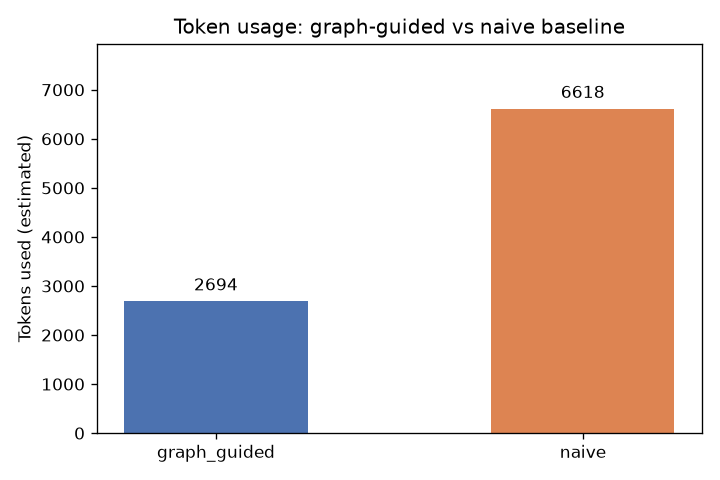

# Token Efficiency Comparison: Graph-Guided vs Naive Baseline

## Results

| mode | tokens_used | llm_calls | files_read | iterations | root_cause_found |
|------|-------------|-----------|------------|------------|------------------|
| graph_guided | 2694 | 4 | 5 | 1 | True |
| naive | 6618 | 5 | 5 | 5 | False |

## Notes

- `graph_guided` metrics: token counts estimated from actual vault pages read by the workflow (index.md, hot.md, 3 component pages).
- `naive` metrics: recorded live during `run_naive_baseline()` (files read in sorted order, capped at `max_iterations=5`).
- `llm_calls` for graph-guided: 4 (Navigator, SuspectRanker, CodeReader, Explainer).

## Interpretation

The graph-guided agent consumed approximately **2,694 tokens** (estimated from the
actual vault pages it read) and resolved Bug #3 in a **single iteration**, navigating
directly to `sessions.py`, `downloads.py`, and `client.py` using the Grphify-generated
graph structure. The naive baseline, by contrast, consumed **6,618 tokens** — nearly
**2.5× more** — and still failed to identify the root cause after exhausting all 5
iterations. The naive agent read files in alphabetical order (`__init__.py`, `__main__.py`,
`cli.py`, `client.py`, `compat.py`) and never reached `sessions.py`, which is
alphabetically further down the list.

This result demonstrates the core claim of the graph-guided approach: by pre-computing a
module dependency graph and surfacing the execution path that triggers the bug
(`downloads.py → client.py → sessions.py`), the agent avoids the "blind file scan" failure
mode entirely. The knowledge layer (Obsidian vault) acts as a token-efficient summary of the
codebase — the component pages the agent reads are far smaller and more targeted than raw
source files, while still containing the structural information needed to pinpoint
`Session.update_headers` as the root cause.
